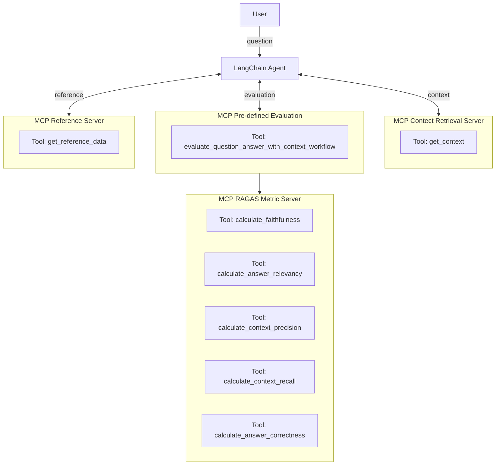

# ragas_mcp

Welcome to **ragas_mcp** – exposing ragas evaluation as MCP server for Agents. We also provide an example for an agent that can pull context and ground truth on it's own and evaluate his answer in a final step. To have more control, we bundle the single metric calls into one mcp call for the agent in this example.


## Features

- **Ragas Single Turn Metrics as MCP Service**
  - Exposes the following RAGAS metrics as callable MCP tools:
    - `calculate_faithfulness`: Evaluates how well a generated answer is supported by retrieved context.
    - `calculate_answer_relevancy`: Measures how directly the generated answer addresses the original user question, using LLM and embedding models.
    - `calculate_context_precision`: Computes the proportion of retrieved passages that are actually relevant to the question.
    - `calculate_context_recall`: Assesses how comprehensively the retrieved passages cover the information in the ground-truth answer.
    - `calculate_answer_correctness`: Combines factual claim overlap and semantic similarity between the generated and reference answers.

- **Flexible LLM and Embedding Model Selection**
  - Supports multiple providers: OpenAI, Azure, Lite, Custom, Anthropic (LLM only).
  - Provider and model selection via environment variables, Docker secrets, or config files.
  - Embedding model selection and configuration for OpenAI-compatible providers.

- **Configurable via Environment Variables and Docker Secrets**
  - API keys can be provided as Docker secrets or environment variables for each provider.
  - LLM and embedding model parameters (model, temperature, max tokens, extra params) are configurable.
  - Supports protocol overrides for OpenAI-compatible endpoints (API base, type, version).

- **Agent and Workflow Integration**
  - Example agent provided that can:
    - Retrieve context and reference data from other MCP servers.
    - Evaluate its own answers using the MCP metric server.
    - Bundle multiple metric calls into a single MCP call for streamlined evaluation.

- **Extensible and Modular**
  - Metric scoring logic is reusable and separated from server code for easy extension.
  - Logging is context-aware and falls back to standard logging if MCP context is not available.
  - Designed for easy addition of new metrics or providers.

- **Dockerized Multi-Service Architecture**
  - Docker Compose setup for running metric, workflow, context, and reference servers in a single network.
  - Example .env.template files for environment variable management.


## Installation

Clone the repo or copy past the code under mcp_metric_server/server.py


## Quickstart

### 1. Clone the repo
```sh
git clone https://github.com/yourusername/ragas_mcp.git
cd ragas_mcp
```


### 2. Configure LLM and Embedding Access
Create a `.env` file in the project root with your API keys and (optionally) endpoint overrides:
```
# For OpenAI
OPENAI_API_KEY=your-openai-key
OPENAI_API_BASE=your-openai-endpoint  # optional, for Azure/OpenAI-compatible endpoints

# For Anthropic
ANTHROPIC_API_KEY=your-anthropic-key
ANTHROPIC_API_BASE=your-anthropic-endpoint  # optional

# You can also use Docker secrets or config files (YAML/JSON) for advanced configuration.
```
For more details and all supported options, see the section below: [Set LLM and embedding model inside the MCP server](#set-llm-and-embedding-model-inside-the-mcp-server)

### 3. Run the MCP Metric Server

#### a. With Docker (recommended)
```sh
docker build -t mcp_ragas .
docker run --rm -e OPENAI_API_KEY=$OPENAI_API_KEY -p 8000:8000 mcp_ragas
```

#### b. With Docker Compose (multi-service example)
```sh
docker compose -f example/docker_composer.yml up --build -d
```

#### c. Locally (for development)
```sh
PYTHONPATH=src python src/server.py
```

### 4. Run the Example Agent (optional)
```sh
python example/agent/agent.py
```

## Architecture for the example



## Set LLM and embedding model inside the MCP server

We support embedding clients via environment variables or Docker secrets inside the mcp server through following ways:

1. API Credentials
   - Place provider-specific API keys in Docker secrets:
     /run/secrets/openai_api_key, /run/secrets/anthropic_api_key, etc.
   - Or export environment variables:
     OPENAI_API_KEY, ANTHROPIC_API_KEY, API_KEY (default fallback for OpenAI API usage - for example when using liteLLM).

2. Selecting the LLM Provider
   - Optional override: LLM_PROVIDER (openai, azure, lite, custom, anthropic).
   - Automatic detection by presence of secrets or env vars if unset.

3. Tuning LLM Parameters
   - LLM_MODEL        (fallbacks by provider: e.g. gpt-4o-mini or claude-2)
   - LLM_TEMPERATURE  (float)
   - LLM_MAX_TOKENS   (int)
   - LLM_EXTRA_PARAMS (JSON string for arbitrary overrides)
   - Optional: LLM_CONFIG_FILE at location "/app/mcp_config.yaml" to mount YAML/JSON for configs with a top-level `llm:` key.

4. Embedding Configuration
   - EMBEDDING_PROVIDER  (openai, azure, lite, custom) defaults to openai.
   - EMBEDDING_MODEL     (fallbacks by provider: e.g. text-embedding-3-small for openai)
   - EMBEDDING_EXTRA_PARAMS (JSON string for embeddings-specific overrides)

5. OpenAI‑API Protocol Overrides (for any OpenAI-compatible provider)
   - set environment varialbes at startup for OPENAI_API_BASE, OPENAI_API_TYPE, OPENAI_API_VERSION
"""


## Using the MCP Server in Desktop Applications

You can integrate the MCP Metric Server with desktop applications that support the Model Context Protocol (MCP), such as VSCode extensions or Claude desktop clients.

### Example: Adding the MCP Server to a VSCode Extension

1. Start the MCP Metric Server (see Quickstart above).
2. In your VSCode extension or compatible client, add a new MCP server endpoint:
   - **URL:** `http://localhost:8000/mcp`
   - **Description:** (optional) RAGAS metrics server for LLM evaluation
3. The extension should now be able to call the exposed tools (e.g., `calculate_faithfulness`, `calculate_answer_relevancy`, etc.) for evaluation tasks.


### Running with Claude Desktop

1. Download [Claude Desktop](https://claude.ai/download)
2. Create or edit your Claude Desktop configuration:
   - On macOS: `~/Library/Application Support/Claude/claude_desktop_config.json`
   - On Windows: `%APPDATA%\Claude\claude_desktop_config.json`

Add the following configuration (add to or merge with your existing `mcpServers` section):

```json
{
  "mcpServers": {
    "ragas-mcp": {
      "url": "http://localhost:8000/mcp",
      "env": {
        "OPENAI_API_KEY": "your-openai-key",
        "OPENAI_API_BASE": "https://api.openai.com/v1",  // optional
        "ANTHROPIC_API_KEY": "your-anthropic-key"        // optional
      },
      "description": "RAGAS metrics server for LLM evaluation"
    }
  }
}
```

You can add or adjust environment variables as needed for your use case. Save the file and restart Claude Desktop.

> **Tip:** For other YAML/JSON-based MCP clients, use a similar structure: specify the `url` and `env` for your MCP server.

For more details, refer to the documentation of your specific MCP-compatible application.

## License

MIT

---

**Questions or feedback?**  
Open an issue or reach out!